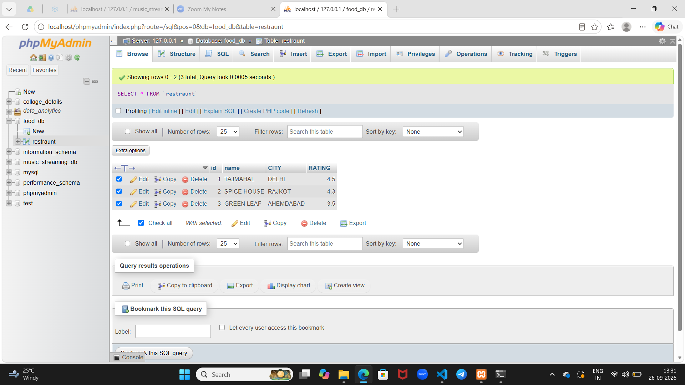

Tasks

1.Open your SQL editor and run a query to select all columns from a table named restaurants using SELECT * FROM restaurants;.

2.Write an SQL query to display only the name and rating columns from the table zomato_reviews.

3.Write an SQL query to select the movie_name and release_year columns from a table called movies, but rename movie_name as 'Title' and release_year as 'Year Released' in the output using the AS keyword.

4.In a table called products, write an SQL query that selects all columns and add a comment in your SQL code explaining what the query does.<br><br><em><strong>Hint:</strong> Use -- to write a single-line comment above your query.</em>

**SOLUTION**

1. **SYNTAX**

CREATE TABLE NAMED RESTRAUNT in database food_hub

```
CREATE table restraunt(
	id int auto_increment primary key,
	name varchar(255),
	city varchar(250),
	rating decimal(2,1)
);
```
**syntax**

```
SELECT * FROM restaurants;
```


2. 